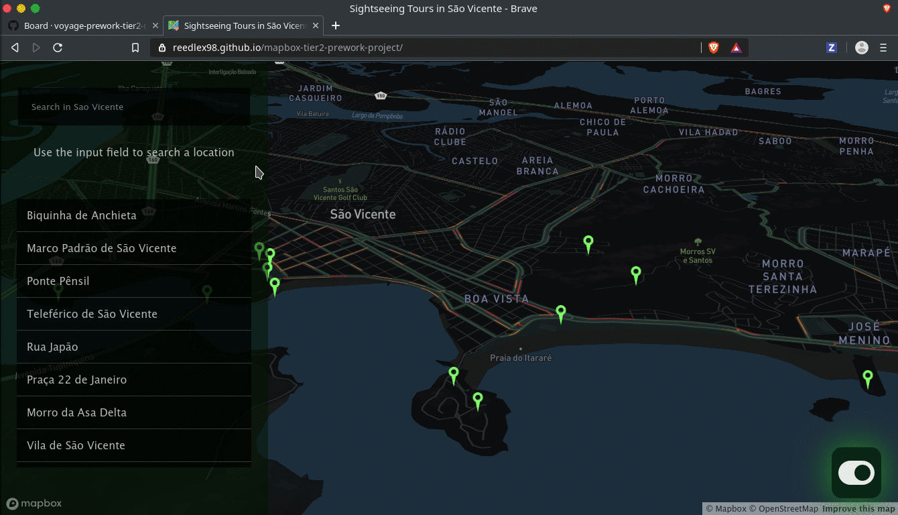

# Chingu Voyage Pre-work Project (Tier 2): Mapbox API App



## Overview

The goal of this project is to complete the Tier 2 Solo Project for [Chingu][1]
Voyage 11.

## Run Locally

It's really simple, you just need to clone this repository in your local machine

### Clone Repo

```bash
git clone https://github.com/reedlex98/mapbox-tier2-prework-project.git
cd mapbox-tier2-prework-project
npm install
```

### Run The App For Development

```bash
npm run dev
```

### Run for Production

```bash
npm run build && npm start
```

[1]: https://chingu.io/ 'Chingu'